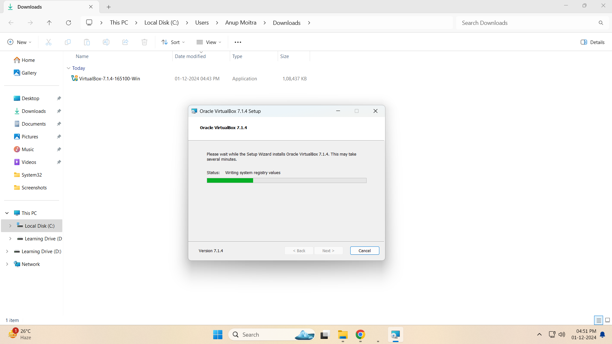
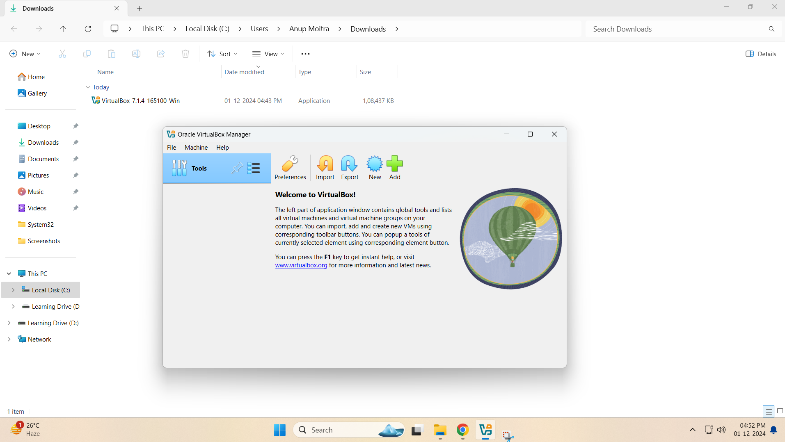

# Module 1: Virtual Lab Setup  

## Chapter 1: Download and Install VirtualBox  

### Introduction  
In this chapter, we'll walk through the steps to download and install VirtualBox on our system. This will set up a foundational lab that supports our learning of Linux basics and prepares us for future topics.  

---

### Step-by-Step Instructions  

#### 1. Download the VirtualBox Installer  
- Visit the [VirtualBox website](https://www.virtualbox.org/wiki/Downloads).  
- Select and download the installer that matches your operating system.  

#### 2. Run the Installer  
- Launch the downloaded installer file.  
- Follow the on-screen prompts and proceed with the installation.  

#### 3. Verify Installation  
- Open VirtualBox to ensure it's properly installed.  
- Check the version to confirm successful installation.  

---

### Screenshots  

#### 1. VirtualBox Download Page  
  
*Figure 1: VirtualBox Download Page*  

#### 2. VirtualBox Installer Start  
  
*Figure 2: VirtualBox Installer Start*  

#### 3. VirtualBox Installation Progress  
  
*Figure 3: VirtualBox Installation Progress*  

#### 4. VirtualBox Installation Finish  
  
*Figure 4: VirtualBox Installation Finish*  

#### 5. VirtualBox First Launch  
  
*Figure 5: VirtualBox First Launch*  

---

**Note**: Ensure you follow the installation prompts carefully.  

---

## Chapter 2: Creating a Virtual Machine  

### Introduction  
This chapter will guide you through creating a Virtual Machine (VM) in VirtualBox. Virtual Machines are crucial for running and testing Linux systems in a controlled environment.  

---

### Step-by-Step Instructions  

#### 1. Open VirtualBox  
- Launch VirtualBox on your system.  

#### 2. Start the VM Creation Wizard  
- Click the **New** button to start creating a virtual machine.  

#### 3. Configure VM Settings  
- Enter a name for your VM (e.g., "Linux-CentOS").  
- Choose the type (Linux) and version (e.g., "Red Hat (64-bit)").  
- Assign the desired memory (RAM) and hard disk size.  

#### 4. Finalize VM Creation  
- Complete the wizard and confirm the VM is listed in the VirtualBox Manager.  

---

### Screenshots  

#### 1. Starting the VM Creation Wizard  
  
*Figure 6: Starting the VM Creation Wizard*  

#### 2. Choosing OS Type and Version  
  
*Figure 7: Choosing OS Type and Version*  

#### 3. Setting Memory and Storage  
  
*Figure 8: Setting Memory and Storage*  

---

**Note**: Ensure that you allocate resources based on your system's capacity.
