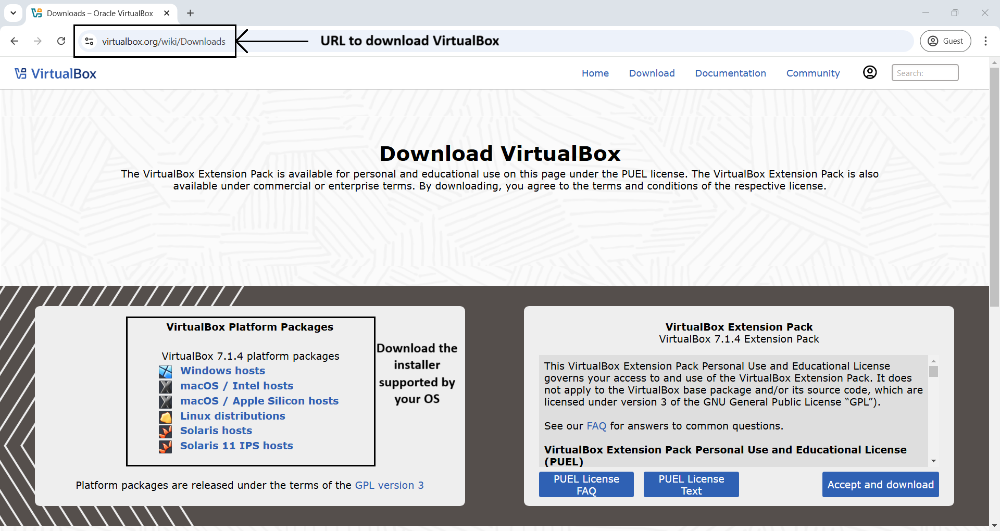

# Module 1: Virtual Lab Setup

## Chapter 1: Download and Install VirtualBox

### Introduction
In this chapter, we will guide you through the process of downloading and installing VirtualBox on your system. This will establish a foundational lab that supports our learning of Linux basics and prepares us for future topics.

---

### Step-by-Step Instructions

#### 1. Download the VirtualBox Installer
- Visit the [VirtualBox website](https://www.virtualbox.org/wiki/Downloads).
- Choose the installer that matches your operating system and download it.

#### 2. Run the Installer
- Launch the downloaded installer file.
- Follow the on-screen prompts to proceed with the installation.
  - Select installation location.
  - Customize setup options if needed.
  - Click "Install" to start the installation process.

#### 3. Verify Installation
- Open VirtualBox to ensure it is properly installed.
- Check the version number to confirm a successful installation.

---

### Screenshots

#### 1. VirtualBox Download Page

*Figure 1: VirtualBox Download Page*

#### 2. VirtualBox Installer Start

*Figure 2: VirtualBox Installer Start*

#### 3. VirtualBox Installation Progress

*Figure 3: VirtualBox Installation Progress*

#### 4. VirtualBox Installation Finish

*Figure 4: VirtualBox Installation Finish*

#### 5. VirtualBox First Launch

*Figure 5: VirtualBox First Launch*

---

**Note**: Carefully follow the installation prompts to avoid any issues.

---
