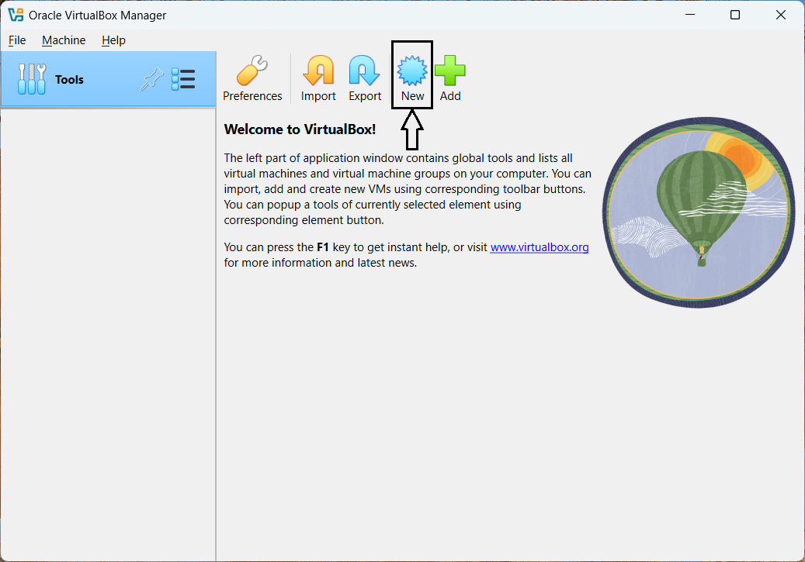
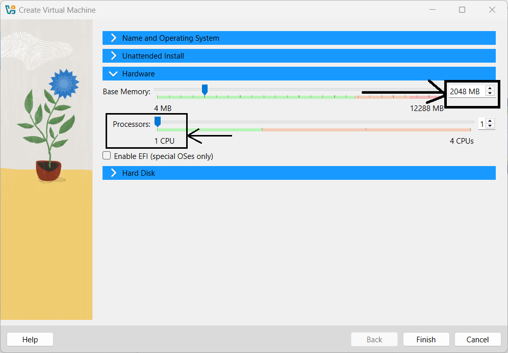

# **Module 1: Virtual Lab Setup**  

## **Chapter 2: Creating and Configuring a Virtual Machine**  

  

---

### **📝 Introduction**  
In this chapter, I will guide you through the process of creating and configuring a virtual machine (VM) using **VirtualBox**. This is a crucial first step in preparing for the next chapter, where I'll demonstrate how to download, install, and set up **CentOS Stream 9**, a popular Linux distribution, within this virtual environment.

---

### **👇 Step-by-Step Instructions**  

#### **🚀 1. Launch VirtualBox**  
- Start by opening **VirtualBox** from your system's application menu or desktop shortcut.  

#### **🖥️ 2. Create a New Virtual Machine**  
- Click the **“New”** button to initiate the virtual machine setup wizard.  
- Assign a name to the VM, for example **"CentOS Stream 9"**. This name is used within **VirtualBox** and is separate from the hostname, which will be configured during the OS installation.  
- Choose the folder where the VM files will be stored (e.g., `C:\Users\<YourUsername>\VirtualBox VMs`). Ensure the location has enough space for the VM and its virtual disk files.  
- Leave the **ISO image** field blank for now; we’ll configure it during the OS installation in the next chapter.  
- Select **Linux** as the type and set the version to **Red Hat (64-bit)**, since CentOS is derived from **Red Hat Enterprise Linux**. Ensure the selected version matches CentOS Stream 9 (64-bit).  
- Skip the **Unattended Installation** option to allow manual OS installation with customization.  
- In the **Hardware Configuration** section, allocate at least **2 GB (2048 MB)** of RAM for CentOS Stream 9, but adjust based on your system's available resources and anticipated workload.  
- For the **Processor** section, keep the default of 1 CPU core. You can increase this later for better performance based on your system's capability.  
- Create a **new virtual hard disk** or select an existing one if needed. Choose **VDI (VirtualBox Disk Image)** as the disk type. Decide between **dynamically allocated** or **fixed size** based on your preferences. Set the hard disk size to **at least 20 GB** to ensure sufficient space for the OS and additional software.  

---

### **🌐 Configuring Network Settings**  

- After the VM is created, select it and click on the **“Settings”** button.  
- Go to the **Network** tab and verify that the network adapter is enabled. By default, it’s set to **NAT**, which provides basic network access. For enhanced connectivity, change it to **Bridged Adapter**, placing the VM on the same network as your host machine. This allows the VM to communicate with other devices and access the internet as though it were a physical machine.  
- Click **OK** to save the network settings.  

---

### **📸 Screenshots**  

#### **1. VirtualBox Main Window**  
  
*Figure 1: Locate the "New" button to start creating a new VM.*

#### **2. VM Creation Wizard - Name, Path, OS Type, and Version**  
  
*Figure 2: Enter the VM name, specify the path, and select the OS type and version. Choose **Linux** as the type and set the version to **Red Hat (64-bit)** to match CentOS Stream 9.*

#### **3. VM Creation Wizard - Hardware Configuration**  
  
*Figure 3: Allocate RAM to the VM. A minimum of 2 GB (2048 MB) is recommended for CentOS Stream 9, which can be adjusted based on your system's capacity and workload. Keep the default setting of 1 CPU core, which you can increase later for better performance.*

#### **4. VM Creation Wizard - Hard Disk Configuration**  
  
*Figure 4: Create a new virtual hard disk or select an existing one. Choose **VDI (VirtualBox Disk Image)** as the disk type and decide between **dynamically allocated** or **fixed size** based on your needs. Set the disk size to at least 20 GB for the operating system and any additional software.*

#### **5. Accessing the VM Settings**  
  
*Figure 5: Select the VM and click on the “Settings” button to configure its options.*

#### **6. Configuring the Network Adapter**  
  
*Figure 6: Navigate to the **Network** tab and change the network adapter from **NAT** to **Bridged Adapter** for improved connectivity. This setting places the VM on the same network as your host machine, allowing it to communicate with other devices and access the internet like a physical machine.*

---

### **🎯 Conclusion**  
Your virtual machine is now created and ready for the next step. In the upcoming chapter, I'll walk you through downloading the **CentOS Stream 9** ISO image, attaching it to the VM, and detailing the installation process.  

---
