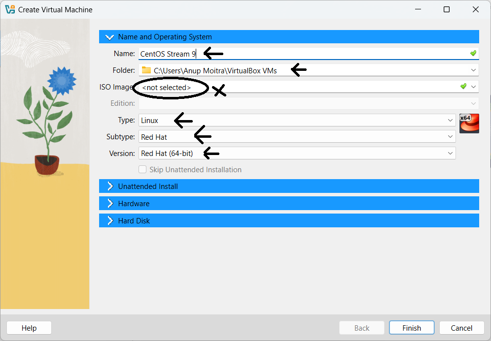
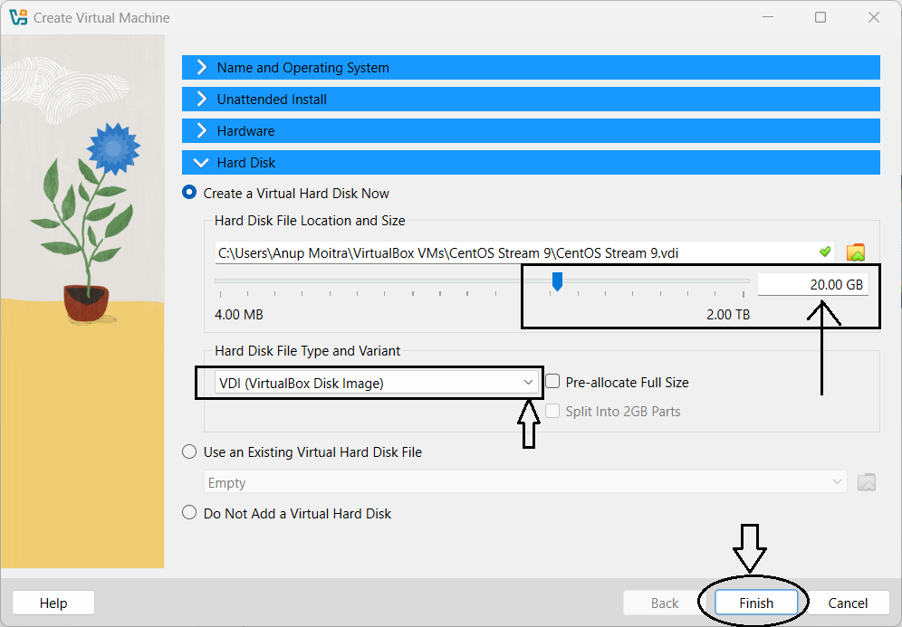

# Module 1: Virtual Lab Setup  

## Chapter 2: Creating and Configuring a Virtual Machine  

### Introduction  
In this chapter, I will guide you through the process of creating and configuring a virtual machine (VM) using VirtualBox. This is a crucial first step in preparing for the next chapter, where I'll demonstrate how to download, install, and set up CentOS Stream 9, a popular Linux distribution, within this virtual environment.  

---

### Step-by-Step Instructions  

#### 1. Launch VirtualBox  
- Start by opening **VirtualBox** from your system's application menu or desktop shortcut.  

#### 2. Create a New Virtual Machine  
- Click the **“New”** button to initiate the virtual machine setup wizard.  
- Assign a name to the VM as **"CentOS Stream 9"**. This name will be used within VirtualBox and is different from the hostname, which will be configured during the OS installation.  
- Choose the folder where the VM files will be stored (e.g., `C:\Users\<YourUsername>\VirtualBox VMs`). Ensure the chosen location has sufficient space to accommodate the VM and its virtual disk files.  
- Leave the **ISO image** field blank for now; we’ll download it in the next chapter and configure it during the OS installation.  
- Select **Linux** as the type and set the version to **Red Hat (64-bit)**, as CentOS is derived from Red Hat Enterprise Linux. Ensure the selected version aligns with CentOS Stream 9 (64-bit).  
- Skip the **Unattended Installation** option to manually set up the OS installation for customization.  
- Proceed to the **Hardware Configuration** section and allocate **RAM** to the VM. A minimum of 2 GB (2048 MB) is recommended for CentOS Stream 9, though this can be adjusted according to your system's available resources and anticipated workload.  
- For the **Processor** section, leave the default at 1 CPU core for now. You can increase this number later based on performance needs and system capability.  
- Create a new **virtual hard disk** or select an existing one if needed. Opt for **VDI (VirtualBox Disk Image)** as the disk type. Choose between **dynamically allocated** or **fixed size** based on your storage needs and preferences. Set the hard disk size to at least 20 GB to ensure sufficient space for the OS and additional software.  

---

### Configuring Network Settings  

- After the VM is created, select it and click on the **“Settings”** button.  
- Navigate to the **Network** tab and confirm that the network adapter is enabled. By default, it is set to **NAT**, which provides basic network access. For enhanced connectivity, switch it to **Bridged Adapter**. This setting places the VM on the same network as your host machine, allowing it to communicate with other devices and access the internet as if it were a physical system.  
- Click **OK** to save the network configuration.  

---

### Screenshots  

#### 1. VirtualBox Main Window  
  
*Figure 1: Locate the "New" button to start the creation of a new VM.*  

#### 2. VM Creation Wizard - Name, Path, OS Type, and Version  
  
*Figure 2: Enter the VM name, specify the path, and select the OS type and version. Choose **Linux** as the type and set the version to **Red Hat (64-bit)** to match CentOS Stream 9.*  

#### 3. VM Creation Wizard - Hardware Configuration  
  
*Figure 3: Allocate RAM to the VM. A minimum of 2 GB (2048 MB) is recommended for CentOS Stream 9, which can be adjusted based on your system's capacity and workload. Keep the default setting of 1 CPU core, which you can increase later for better performance.*  

#### 4. VM Creation Wizard - Hard Disk Configuration  
  
*Figure 4: Create a new virtual hard disk or select an existing one. Choose **VDI (VirtualBox Disk Image)** as the disk type and decide between **dynamically allocated** or **fixed size** based on your needs. Set the disk size to at least 20 GB for the operating system and any additional software.*  

#### 5. Accessing the VM Settings  
  
*Figure 5: Select the VM and click on the “Settings” button to configure its options.*  

#### 6. Configuring the Network Adapter  
  
*Figure 6: Navigate to the **Network** tab and change the network adapter from **NAT** to **Bridged Adapter** for improved connectivity. This setting will place the VM on the same network as your host machine, allowing it to communicate with other devices and access the internet like a physical machine.*  

---

### Conclusion  
Your virtual machine is now created and ready for the next step. In the upcoming chapter, I'll walk you through downloading the CentOS Stream 9 ISO image, attaching it to the VM, and detailing the installation process.
