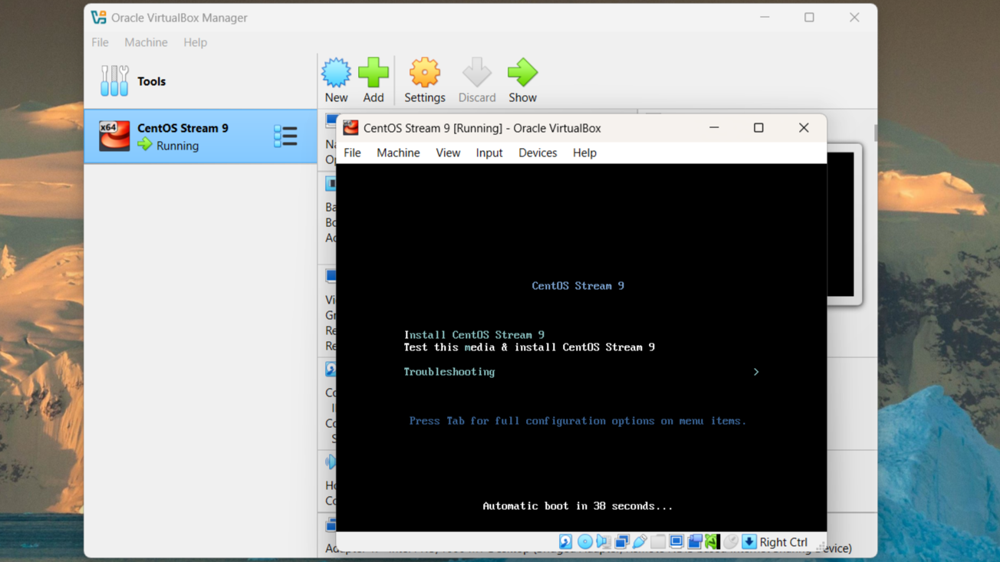
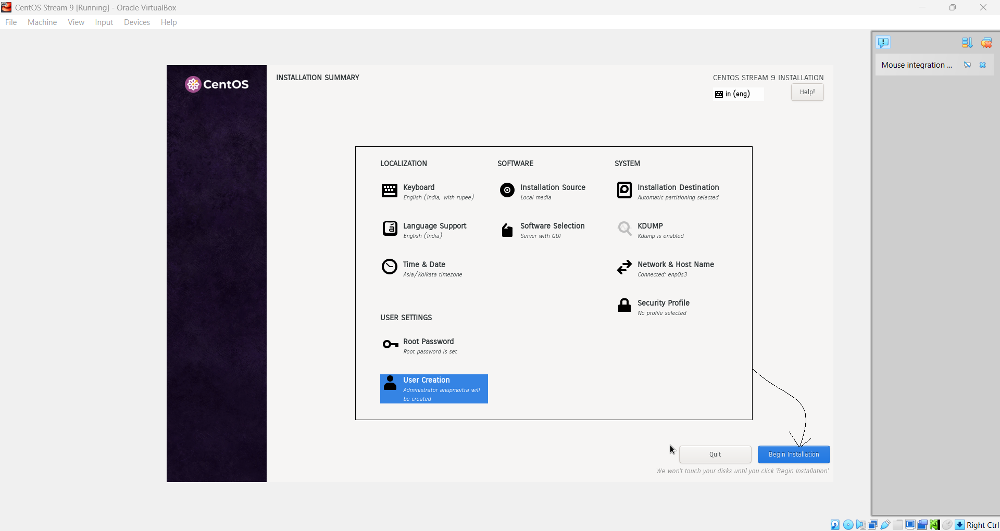
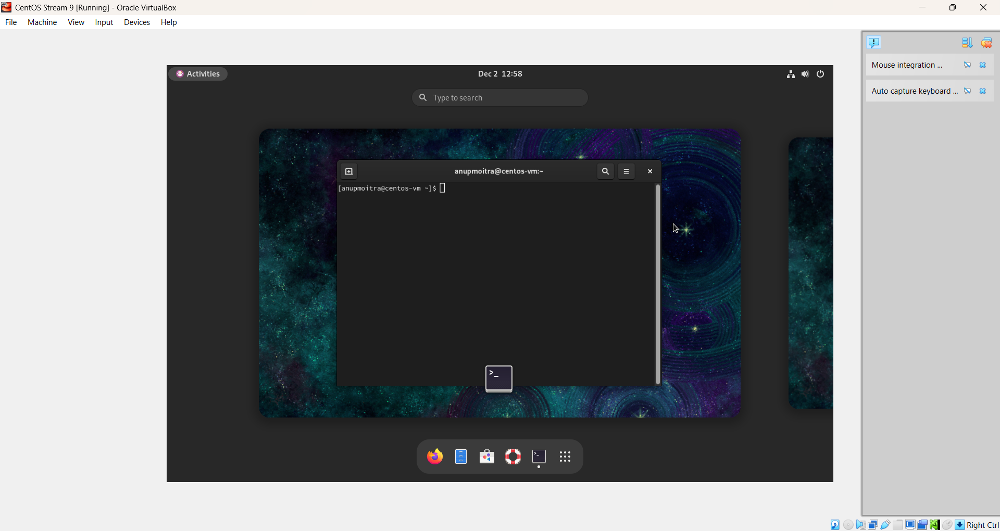

*Module 1: Virtual Lab Setup*
# Download and Install Linux (CentOS Stream 9)

## Introduction
In this chapter, we will cover how to download and install the CentOS Stream 9 operating system. This chapter provides detailed instructions to set up CentOS Stream 9 in our virtual environment.

**What We Will Learn:**
- How to download the CentOS Stream 9 ISO image.
- Step-by-step instructions for installing CentOS Stream 9 on our virtual machine.

---

### Step 1: Visit the CentOS Download Page and Download CentOS Stream 9

1. Open your web browser and go to the [CentOS download page](https://www.centos.org/download/).
2. Locate the section for **CentOS Stream 9** and select the correct architecture for your system, such as **x86_64**.
3. Click on the download link to start downloading the CentOS Stream 9 ISO file.

---

### Step 2: Attach the CentOS ISO to the Virtual Machine

1. Open **VirtualBox** and select the virtual machine you created in the previous chapter (e.g., "CentOS Stream 9").
2. Click on **"Settings"** and navigate to the **"Storage"** tab.
3. In the **Controller: IDE** section, click on the **"Empty"** optical drive icon.
4. Click on the **"Choose a disk file"** option and locate the CentOS Stream 9 ISO file you downloaded.
5. Select the ISO file and click **OK** to attach it to the virtual machine.

---

### Step 3: Boot the Virtual Machine from the ISO

1. Start the virtual machine by clicking the **"Start"** button in VirtualBox.
2. The CentOS Stream 9 installation menu should appear. Select **"Install CentOS Stream 9"** and press **Enter** to begin the installation.

---

### Step 4: Configure Installation Settings

On the **Installation Summary** screen, review and adjust the following settings:

**Localization:**

- **Language and Keyboard Layout**: Select the appropriate language and keyboard layout for the installation (e.g., English (India), English (India, with rupee)), and click **"Continue"**.
- **Date & Time**: Set the correct time zone for your region (e.g., Asia/Kolkata).
- **Language Support**: Ensure your preferred language is selected.

**Software:**

- **Installation Source**: This is typically set to **Local Media** if the ISO file is attached. No changes are needed here.
- **Software Selection**: The screenshot shows **Server with GUI** selected. Choose this if you need a graphical interface; otherwise, select **Minimal Install** for a lightweight server setup.

**System:**

- **Installation Destination**: Select the virtual hard disk created in the previous chapter. If needed, modify the partitioning options or leave the default **Automatic Partitioning**. Click **Done** to save.
- **KDUMP**: Leave this enabled unless you have specific requirements to disable it.
- **Network & Hostname**: Ensure the network adapter is enabled for internet access. Optionally, assign a hostname for the system (e.g., centos-vm.local).

**User Settings:**

- **Root Password**: Set a strong root password to secure the system.
- **User Creation**: Create a new user account with administrator privileges. This is recommended for better security than using the root account for daily tasks.

Click **"Begin Installation"** to start the installation process.

---

### Step 5: Complete the Installation

1. Once the installation is complete, click **"Reboot"** to restart the virtual machine.
2. Ensure the ISO is detached from the virtual machine to boot from the installed operating system.

---

## Screenshots

### 1. CentOS Download Page

*Download the CentOS Stream 9 ISO image.*

### 2. Attach ISO to Virtual Machine

*Attach the CentOS ISO file to the virtual machine.*

### 3. Installation Menu

*Installation menu for CentOS Stream 9.*

### 4. Installation Summary Screen

*Options available on the installation summary screen.*

### 5. CentOS Home Screen

*Initial view of the CentOS home screen after installation.*

---

## Note
The CentOS Stream 9 installation is now complete. The virtual machine is ready for further configuration and use. In the next chapter, we'll explore post-installation setup and basic commands to get started with CentOS Stream 9.

Feel free to continue to the next chapter, where I'll guide you through post-installation tasks for CentOS Stream 9!
