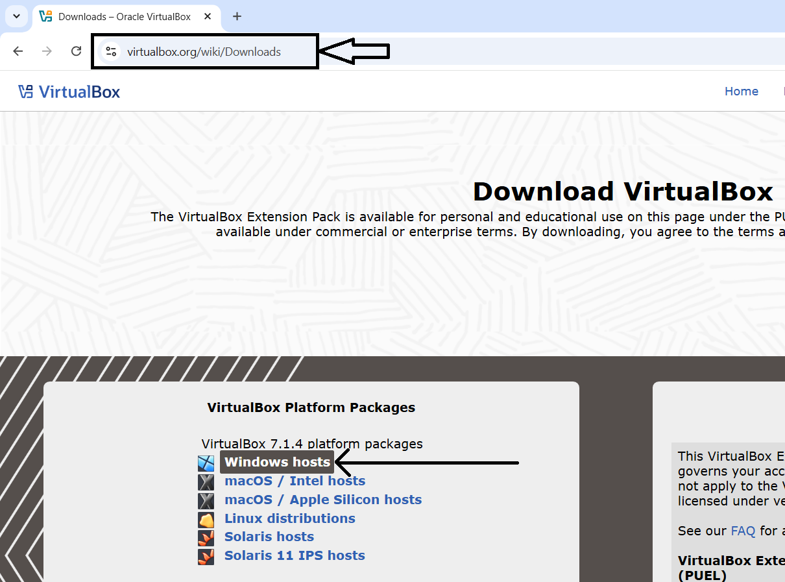
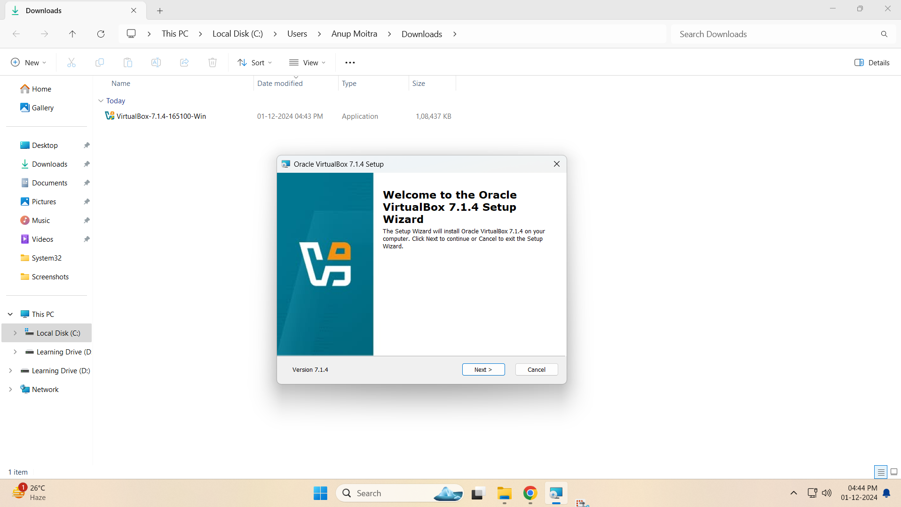

# Chapter 1: Download and Install VirtualBox

## Introduction
This chapter covers the steps to download and install VirtualBox on your system as part of the lab setup for learning Linux basics.

## Step-by-Step Instructions
1. Go to the <a href="https://www.virtualbox.org/wiki/Downloads" target="_blank">VirtualBox website</a> and download the installer for your operating system.
2. Run the installer and follow the on-screen instructions to complete the installation.
3. Verify the installation by launching VirtualBox and checking the version.

## Screenshots
  
*Figure 1: VirtualBox Download Page*

  
*Figure 2: VirtualBox Installer Start*

  
*Figure 3: VirtualBox Installation Progress*

  
*Figure 4: VirtualBox Installation Finish*

  
*Figure 5: VirtualBox First Launch*
