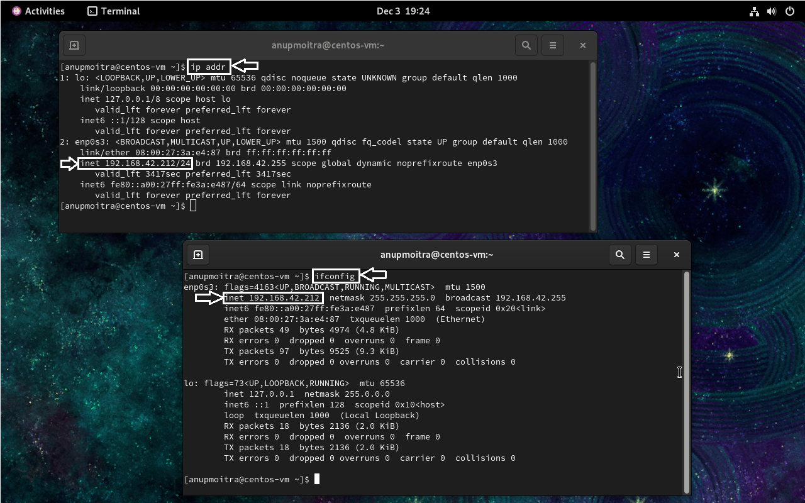

# Module 2: System Access and File Management
## Chapter 3: Accessing Linux Machine via PuTTY or SSH

### Introduction
In this chapter, we will explore how to access a Linux machine remotely through different platforms: Windows SSH client, Mac Terminal, Linux Terminal, and PuTTY on Windows. SSH (Secure Shell) is a protocol used to securely access and manage remote systems.

---

**What We Will Learn:**
- How to access a Linux machine from Windows (using SSH client or PuTTY), macOS, and Linux.
- Finding your Linux machine's IP address.

---

### 1. Finding the IP Address of the Linux Machine

Before connecting, you need to find the IP address of your Linux machine:

1. **Access the Linux Console**: Open your virtual machine or physical machine running Linux.
2. **Run the Command**:
   - For most recent Linux distributions, use:
     ```bash
     ip addr
     ```
   - Older distributions may use:
     ```bash
     ifconfig
     ```
3. **Identify the IP Address**:
   - Look for the `enp0S3` or equivalent interface and note the IP address (e.g., `192.168.42.212`).
   - If `ifconfig` is not available, install it using:
     ```bash
     sudo yum install net-tools
     ```

**Screenshot Example**:  
The following screenshot demonstrates using both `ip addr` and `ifconfig` commands to find the IP address:  


---

### 2. Accessing Linux Machine via PuTTY (Windows)

If you're using Windows and prefer a graphical SSH client, **PuTTY** is a popular option. Follow these steps to connect:

1. **Download and Install PuTTY**:
   - If you haven’t installed PuTTY yet, refer to the steps outlined in **[Chapter 2: Accessing Linux Systems](https://github.com/anup-cloudguru/foundational-linux-training-projects/blob/main/02-system-access-and-file-management/02-accessing-linux-system.md)**.

2. **Launch PuTTY**:
   - Open PuTTY from your Start menu or search bar.

3. **Configure the SSH Connection**:
   - In the **Session** tab:
     - Enter the **IP address** of the Linux machine in the "Host Name (or IP address)" field.
     - Ensure the **Port** is set to `22` (default SSH port).
   - Select the **Connection Type** as `SSH`.

4. **Start the Session**:
   - Click **Open** to initiate the SSH session.
   - If it's your first time connecting, PuTTY will display a security alert about the server's key. Click **Accept**.

5. **Login**:
   - Enter your Linux **username** and press Enter.
   - Type your **password** (note: it won't be visible as you type) and press Enter.

**Screenshot Example**:  
*PuTTY configuration and successful login*  


---

### 3. Accessing Linux Machine via Windows SSH Client

1. **Open the Windows Command Prompt**: Type `cmd` in the search bar and hit Enter.
2. **Verify SSH Installation**: Type `ssh` and press Enter. If you see a list of options, SSH is installed.
3. **Connect to the Linux Machine**:
   - **Option 1 (using `-l`)**:
     ```bash
     ssh -l <username> <IP_address>
     ```
   - **Option 2 (using `@`)**:
     ```bash
     ssh <username>@<IP_address>
     ```
   - **Example**:
     - Using `-l`:
       ```bash
       ssh -l anupmoitra 192.168.42.212
       ```
     - Using `@`:
       ```bash
       ssh anupmoitra@192.168.42.212
       ```
   - Enter your password when prompted, and you will be logged into the Linux machine.

**Screenshot Example**:  
*Windows Command Prompt for SSH connection*  
  
*The terminal prompt showing successful login.*

---

### 4. Accessing Linux Machine via Mac Terminal

1. **Open Terminal**: Use the Spotlight search (Cmd + Space) and type `Terminal`, then hit Enter.
2. **Connect to the Linux Machine**:
   - **Option 1 (using `-l`)**:
     ```bash
     ssh -l <username> <IP_address>
     ```
   - **Option 2 (using `@`)**:
     ```bash
     ssh <username>@<IP_address>
     ```
   - **Example**:
     - Using `-l`:
       ```bash
       ssh -l anupmoitra 192.168.42.212
       ```
     - Using `@`:
       ```bash
       ssh anupmoitra@192.168.42.212
       ```
   - Enter your password when prompted, and you will be connected to the Linux machine.

**Screenshot Example**:  
*Mac Terminal showing the SSH command*  
  
*Connected session in Terminal.*

---

### 5. Accessing Linux Machine via Linux Terminal

1. **Open Terminal**: Press Ctrl + Alt + T or search for Terminal in your applications.
2. **Connect to the Linux Machine**:
   - **Option 1 (using `-l`)**:
     ```bash
     ssh -l <username> <IP_address>
     ```
   - **Option 2 (using `@`)**:
     ```bash
     ssh <username>@<IP_address>
     ```
   - **Example**:
     - Using `-l`:
       ```bash
       ssh -l anupmoitra 192.168.42.212
       ```
     - Using `@`:
       ```bash
       ssh anupmoitra@192.168.42.212
       ```
   - Enter your password when prompted to complete the connection.

**Screenshot Example**:  
*Linux Terminal displaying SSH connection*  
  
*Successful login to the Linux machine.*

---

## Conclusion

You can access a Linux machine from various platforms using either command-line utilities like `ssh` or graphical tools like **PuTTY**. While modern Windows systems include an SSH client, PuTTY remains a robust and widely-used option, especially for users preferring a GUI-based approach. Always use strong passwords or SSH keys to ensure the security of your remote connections.

---
