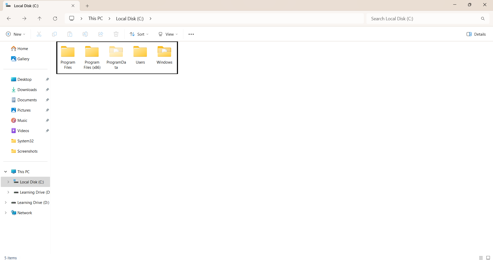
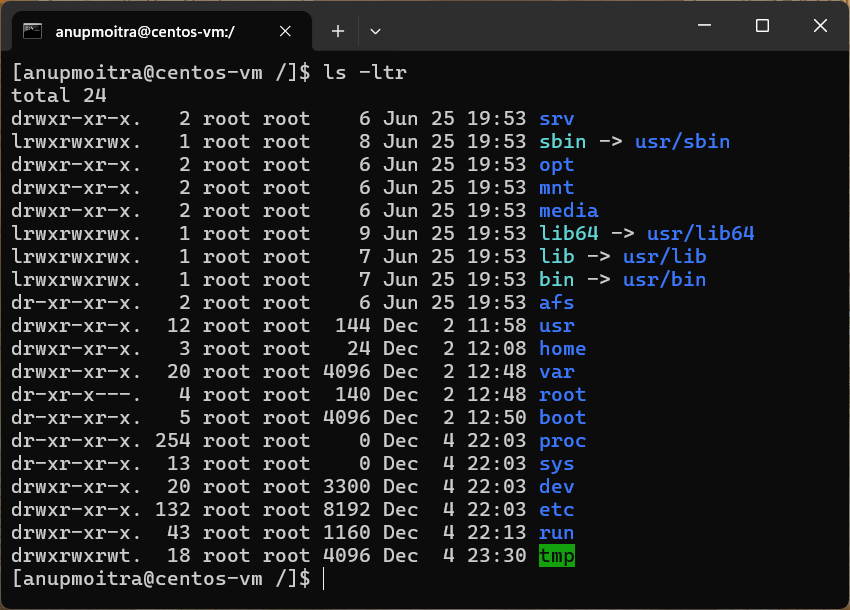

# Module 2: System Access and File Management

## Chapter 5: Filesystem Basics

### Introduction
In this chapter, we will explore the concept of a filesystem and its role in managing files and directories. Understanding the structure of a filesystem is fundamental for efficient data organization and navigation in both Windows and Linux environments.

**What We Will Learn:**
- The purpose and structure of filesystems.
- Key directories in Windows and Linux.
- How to navigate filesystems using GUI and command-line tools.
- Practical comparisons of Windows and Linux filesystem structures.

---

### 1. What is a Filesystem?

A filesystem is the method used by an operating system to manage data on storage devices, organizing files and directories to enable efficient access and retrieval.

**Analogy**: Imagine a filesystem as a library where books (files) are categorized and stored in sections (directories). Without this organization, finding specific books would be a daunting task.

---

### 2. Filesystem Structure Overview

#### Windows Filesystem
Windows organizes its filesystem with drive letters (e.g., `C:\`) representing storage volumes. Each drive contains a hierarchical directory structure.

**Key Visible Directories in `C:\` (Windows):**

| **Directory**               | **Description** |
|-----------------------------|-----------------|
| `C:\Windows`                | System files and configurations necessary for Windows operation. |
| `C:\Users`                  | User profiles and personal data storage. Each user has a separate directory (e.g., `C:\Users\John`). |
| `C:\Program Files`          | Installed applications for 64-bit programs. |
| `C:\Program Files (x86)`    | Installed applications designed for 32-bit programs on 64-bit systems. |
| `C:\ProgramData`            | Application data shared across all users. |

**Example Screenshot**:
  
*Figure 1: Example of Windows Filesystem Structure.*

---

#### Linux Filesystem
Linux employs a unified structure with a single root directory (`/`) from which all files and directories branch out.

**Key Directories in Linux:**

| **Directory** | **Description** |
|---------------|-----------------|
| /boot       | Holds the files needed to start your computer, including important files like grub.cfg used by the boot loader. |
| /root       | The home directory for the "root user," who has the highest level of control over the system. It’s where the system administrator stores personal files. |
| /dev        | Contains files that represent all hardware devices, such as disk drives, keyboards, and USB drives. These are interfaces for the system to communicate with the hardware. |
| /etc        | Stores configuration files for the system and applications, such as network settings, user details, and system preferences. |
| /bin and /usr/bin | Contains essential commands used daily (e.g., ls, cp). These are basic tools for running and managing the system. |
| /sbin and /usr/sbin | Includes system commands mainly used by administrators for system maintenance, such as starting and stopping services. |
| /opt        | Used for optional software installed separately from the main system. |
| /proc       | A virtual directory showing real-time information about running processes and system performance, such as memory usage. |
| /lib and /usr/lib | Contains libraries that programs use to run, including tools for tasks like displaying graphics or connecting to the internet. |
| /tmp        | Stores temporary files, which are usually deleted when the system restarts. Acts as a scratchpad for the computer. |
| /home       | Stores each user’s personal files. For example, /home/john is where user john keeps their documents and data. |
| /var        | Holds files that change frequently, such as logs, cache, and history files. |
| /run        | Stores temporary files that exist only while the system is running, including files for running processes and services. |
| /mnt        | Used for manually mounting external storage devices or network filesystems, such as an external hard drive. |
| /media      | Typically used for automatically mounting removable media like USB drives or CD-ROMs. |

**Example Screenshot**:

  
*Figure 2: Example of Linux Filesystem Structure.*

---

### 3. Navigating the Filesystem

#### Windows Navigation
- **Graphical Interface**: Use File Explorer to browse directories and manage files. For example, navigate to `C:\Users\YourUsername\Documents`.


- **Command-Line Interface**: Use Command Prompt or PowerShell for navigation and file operations.

**Example Command**:
```cmd
cd C:\Users\YourUsername\Documents
```

---

#### Linux Navigation
- **Graphical Interface**: File managers like Nautilus (Ubuntu) or Dolphin (KDE) provide GUI access.


- **Terminal**: Use commands like `cd` (change directory) and `ls` (list directory contents) for navigation.

**Example Command**:
```bash
cd /home/username/Documents
ls -l
```

---

### 4. Comparing Filesystem Structures

| **Aspect**            | **Windows**                        | **Linux**                              |
|-----------------------|------------------------------------|---------------------------------------|
| **Root Directory**    | Separate volumes (e.g., `C:\`)    | Single root directory (`/`)          |
| **Directory Paths**   | Use backslashes (e.g., `C:\`)     | Use forward slashes (e.g., `/home`)  |
| **User Directories**  | `C:\Users`                       | `/home/username` for regular users, `/root` for the root user|
| **Configuration Files** | Scattered across `C:\`         | Centralized in `/etc`                |

---

### 5. Importance of Filesystems

A structured filesystem:
- Facilitates quick access to files.
- Improves system performance by preventing clutter.
- Ensures efficient management of user data, system configurations, and application files.

---

## Conclusion

Understanding filesystem structures and navigation is essential for working effectively with any operating system. Familiarity with both Windows and Linux filesystems will help you manage data, troubleshoot issues, and enhance productivity.

---
