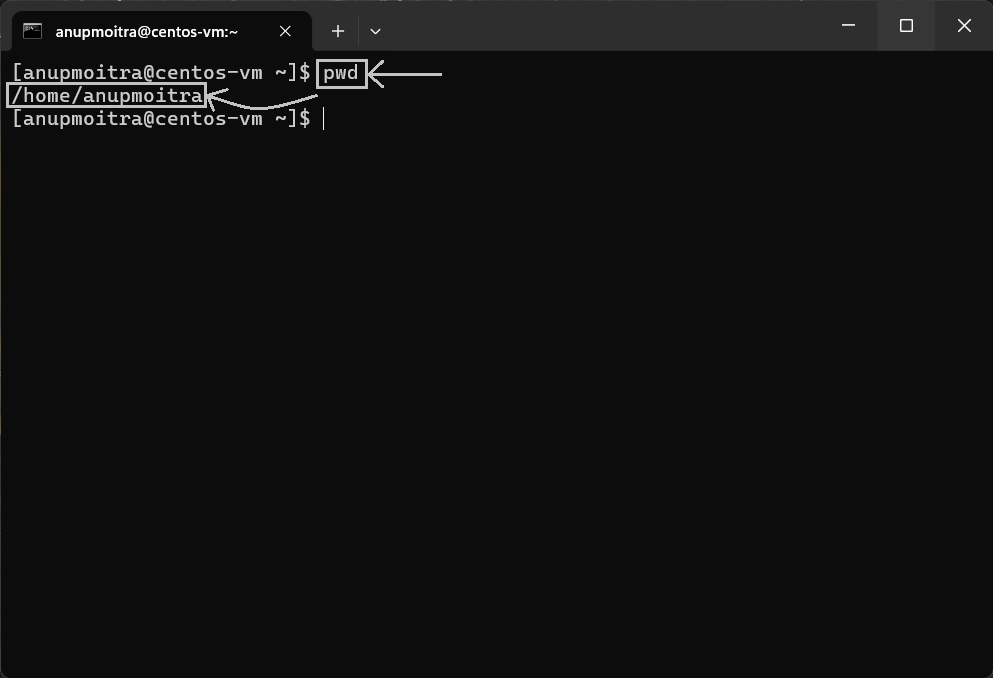
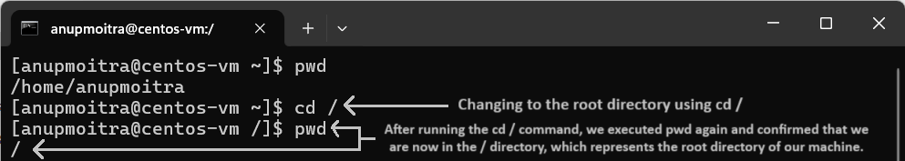
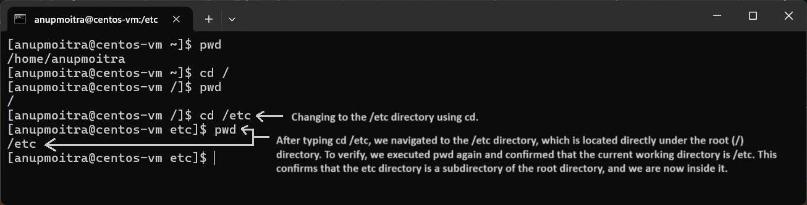
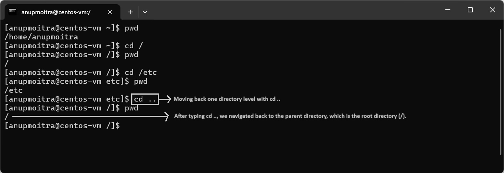
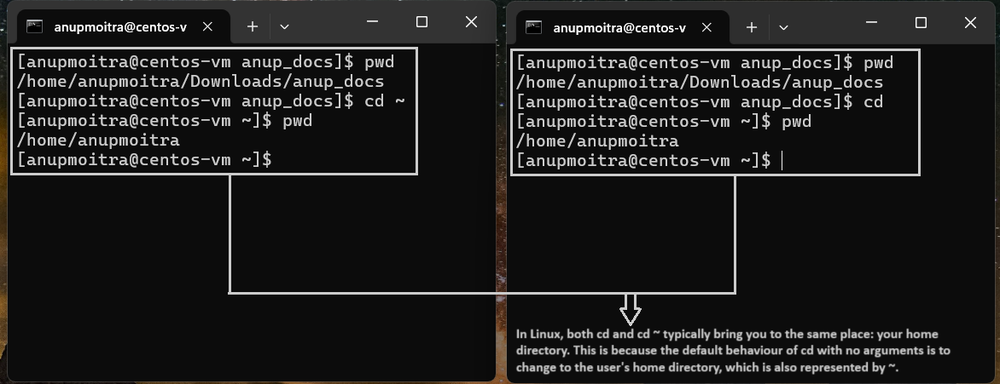

# **Module 2: System Access and File Management**

## **Chapter 6: Navigating the File System (cd, ls, pwd)**

### **Introduction**  
In this chapter, we will explore the basic Linux commands for navigating the file system:  
- **`cd`**: Used to change the current directory.  
- **`pwd`**: Prints the full path of the current working directory.  
- **`ls`**: Lists the contents of a directory.  

Mastering these commands will help you efficiently move between directories, locate files, and explore the Linux file system structure.  

---

#### **1.1 `pwd`: Print Working Directory**  
The `pwd` command displays the full path of your current location in the file system. It helps confirm which directory you are currently working in.  

**Example Command**:  
```bash
pwd
```  

**Example Output** (Text Output):  
```
/home/anupmoitra
```

**Example Screenshot** (Terminal Output):  
  
*Figure 1: Displaying the current directory using `pwd`.*

---

#### **1.2 `cd`: Change Directory**  
The `cd` command is used to navigate between directories.  

**Common Usage Examples with Screenshots**:  

1. **Navigate to the root directory**:  
   ```bash
   cd /
   ```  
   **Example Screenshot**:  
     
   *Figure 2: Changing to the root directory using `cd /`.*

2. **Navigate to a specific directory**:  
   ```bash
   cd /etc
   ```  
   **Example Screenshot**:  
     
   *Figure 3: Changing to the `/etc` directory using `cd`.*

3. **Go back one directory level**:  
   ```bash
   cd ..
   ```  
   **Example Screenshot**:  
     
   *Figure 4: Moving back one directory level with `cd ..`.*

#### **4. Return to the Home Directory**  
In Linux, both **`cd`** (with no arguments) and **`cd ~`** take you to your home directory. While **`cd`** is the default command for this purpose, **`cd ~`** explicitly specifies the home directory.  

**Example Commands**:  
```bash
cd          # Takes you to your home directory
cd ~        # Also takes you to your home directory
```  

**Example Screenshot**:  
  
*Figure 5: Returning to the home directory using `cd` or `cd ~`.*

---

#### **1.3 `ls`: List Directory Contents**  
The `ls` command lists the contents of a directory. It supports various options to display additional details.  

**Common Options**:  
- **`ls`**: Lists files and directories in the current directory.  
- **`ls -l`**: Displays detailed information such as file permissions, ownership, and size in a long listing format.  
- **`ls -lt`**: Displays detailed information in a long listing format, sorted by modification time, with the most recently modified files at the top.  
- **`ls -ltr`**: Displays detailed information in a long listing format, sorted by modification time, with the most recently modified files at the bottom.  

**Example Commands and Screenshots**:  

1. **Basic `ls` Command**:  
   ```bash
   ls
   ```  
   **Example Screenshot**:  
     
   *Figure 1: Listing directory contents using `ls`.*

2. **Detailed Listing with `ls -l`**:  
   ```bash
   ls -l
   ```  
   **Example Screenshot**:  
     
   *Figure 2: Detailed listing of directory contents using `ls -l`.*

3. **Sorted by Modification Time with `ls -lt`**:  
   ```bash
   ls -lt
   ```  
   **Example Screenshot**:  
     
   *Figure 3: Directory contents sorted by modification time (newest first) using `ls -lt`.*

4. **Sorted by Modification Time (Reverse Order) with `ls -ltr`**:  
   ```bash
   ls -ltr
   ```  
   **Example Screenshot**:  
     
   *Figure 4: Directory contents sorted by modification time (oldest first) using `ls -ltr`.*

---

## **Conclusion**  
By mastering `cd`, `pwd`, and `ls`, you can efficiently navigate and explore the Linux file system. These commands form the foundation of system administration and file management tasks in Linux environments.  

---
