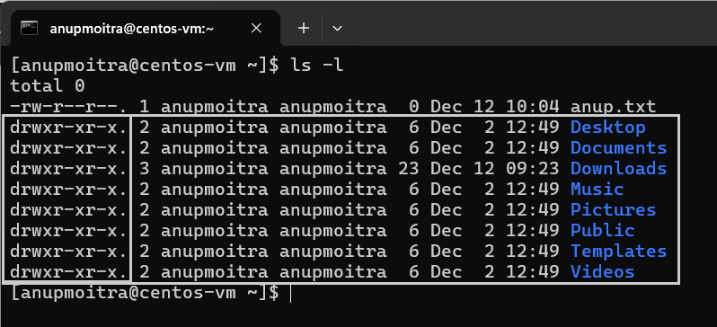
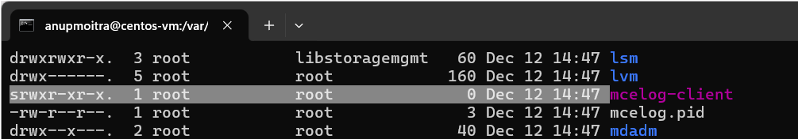

# **Module 2: System Access and File Management**  

## **Chapter 8: Understanding Linux File Types**  

### **Introduction**  
In Linux, every file belongs to a specific file type, each serving unique purposes in the operating system. These include:  
- **Regular Files**: Contain text, executables, or data.  
- **Directories**: Equivalent to folders in Windows.  
- **Links**: Files that reference other files or directories.  
- **Device Files**: Represent hardware devices.  
- **Sockets and Pipes**: Facilitate communication between processes.  

In this chapter, we will explore these file types, how they are represented in the file system, and how to identify them using the `ls -l` command.  

---

### **1. File Types Overview**  

#### **1.1 Regular Files**  
Regular files are the most common type in Linux, containing any form of data, such as:  
- Text files  
- Images and videos  
- Executables  

**Identification**:  
When running `ls -l`, a regular file does not have any special character at the beginning of its attribute string (e.g., `-rw-r--r--`).  

**Example Command**:  
```bash
ls -l
```  

**Example Screenshot**:  
  
*Figure 1: Example of regular files displayed with `ls -l`.* 

---

#### **1.2 Directories**  
Directories in Linux serve as containers for files and other directories, much like folders in Windows.  

**Identification**:  
- Starts with the letter `d` in the `ls -l` output (e.g., `drwxr-xr-x`).  

**Example Command**:  
```bash
ls -l
```  

**Example Screenshot**:  
  
*Figure 2: Example of directories displayed with `ls -l`.*  

---

#### **1.3 Links**  
Links in Linux are special files that reference other files or directories.  

**Identification**:  
- Starts with the letter `l` in the `ls -l` output (e.g., `lrwxrwxrwx`).  

**Example Command**:  
```bash
ls -l
```  

**Example Screenshot**:  
  
*Figure 3: Example of a link displayed with `ls -l`.*  

---

#### **1.4 Device Files**  
Device files represent hardware components and are classified into two types:  

1. **Character Device Files**  
   - Represent devices that process data one character at a time (e.g., keyboards, serial ports).  
   - Identified by the letter `c` in the `ls -l` output.  

2. **Block Device Files**  
   - Represent devices that handle data in blocks (e.g., hard drives, USB drives).  
   - Identified by the letter `b` in the `ls -l` output.  

**Example Command**:  
```bash
ls -l /dev
```  

**Example Screenshot**:  
  
*Figure 4: Example of character (`c`) and block (`b`) device files in the `/dev` directory.*

---

#### **1.5 Sockets**  
Sockets enable network communication between processes, facilitating data exchange.  

**Identification**:  
- Starts with the letter `s` in the `ls -l` output (e.g., `srwxr-xr-x`).  

**Example Screenshot**:  
  
*Figure 1.5: Example of a socket file (`srwxr-xr-x`) in the `ls -l` output.*

---

#### **1.6 Named Pipes (FIFOs)**  
Named pipes, also called FIFOs, allow inter-process communication where data is transmitted in a First In, First Out (FIFO) manner.  

**Identification**:  
- Starts with the letter `p` in the `ls -l` output (e.g., `prw-r--r--`).  

---

### **2. Importance of File Types in Linux**  
- **Understanding File Roles**: Knowing the type of a file helps determine its role in the system.  
- **Effective Troubleshooting**: Identifying device files or sockets aids in debugging hardware or network issues.  
- **Efficient System Administration**: Recognizing links and special files ensures proper file system management.  

---

### **Conclusion**  
Understanding Linux file types is a foundational skill for effective system management. By using the `ls -l` command, you can quickly identify file types and their roles in the operating system. Mastering this knowledge will aid you in troubleshooting, organizing, and managing your Linux environment.  

---  
