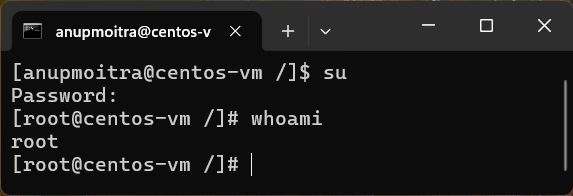

# **Module 2: System Access and File Management**  

## **Chapter 9: Understanding Root in Linux**  

### **Introduction**  
In Linux, the term "root" can refer to multiple things. Understanding the context of root is crucial as it can signify different concepts depending on its usage. In this chapter, we’ll clarify the distinctions between the **root account**, the **root directory (`/`)**, and the **root home directory (`/root`)**.  

---

### **Root in Linux**  

#### **1. Root Account**  
The root account is the most powerful account on a Linux system.  
- It has unrestricted access to all commands and files.  
- Equivalent to the Administrator account in Windows.  
- Represented by the username `root` (lowercase).  

To switch to the root account:  
```bash
sudo -i
```  
or  
```bash
su
```  

**Example Screenshot**:  
  
*Figure 1: Example of switching to the root account using `sudo -i` or `su`.*

---

#### **2. Root Directory (`/`)**  
The root directory is the topmost directory in the Linux filesystem. All other directories and files stem from this directory.  
- The root directory is represented by `/`.  
- To list its contents, use:  
  ```bash
  ls /
  ```  

**Example Screenshot**  
  
*Figure 1: Listing the contents of the root directory*  

---

#### **3. Root Home Directory (`/root`)**  
The root account has its home directory located in `/root`, which is different from regular users' home directories (typically found in `/home/<username>`).  
- The `/root` directory is **only** accessible to the root user. Regular users must switch to the root account to access it.  
- To switch to the root account, use either:  
  ```bash
  sudo -i
  ```  
  or  
  ```bash
  su
  ```
- Once logged in as root, navigate to the root home directory with:  
  ```bash
  cd /root
  ```

**Example Screenshot**  
  
*Figure 2: Navigating to the root home directory (`/root`).* 

---

### **Clarifying Terminology**  
1. **Root Account**  
   - Refers to the superuser account (`root`).  

2. **Root Directory (`/`)**  
   - The topmost directory in the Linux filesystem.  

3. **Root Home Directory (`/root`)**  
   - The home directory for the root user.  

---

### **Conclusion**  
Understanding the distinctions between the root account, the root directory, and the root home directory is essential for working efficiently and securely in a Linux environment. Always ensure to use root privileges responsibly to avoid accidental system damage.  

---
