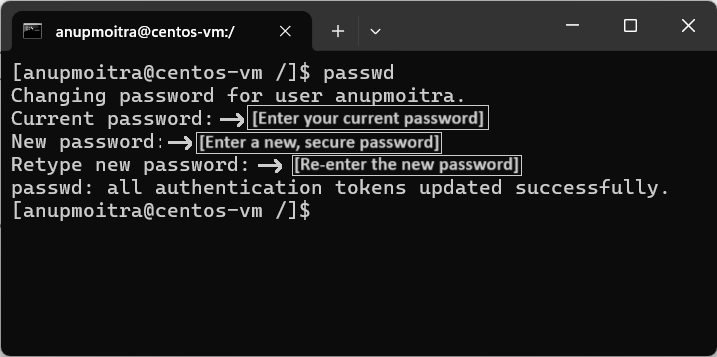

# Module 2: System Access and File Management

## Chapter 10: Changing User Passwords in Linux

### Introduction
In this chapter, we will learn how to change a user password in Linux. This process is essential for maintaining the security of user accounts. Whether you're changing your own password or modifying the password of another user (as the root user), understanding this command is key to managing user credentials.

**What We Will Learn:**
- How to change your own password.
- How to change another user's password (as root).
- Important considerations for password security and best practices.

---

### 1. The `passwd` Command

The `passwd` command is used to change a user’s password in Linux. This command is simple to use and requires the current password for verification.

**Basic Syntax**:
```bash
passwd [username]
```

**Important Note**: 
- If you use `passwd` without specifying a username, it will change the password for the currently logged-in user.
- If you are logged in as `root`, you can use `passwd username` to change another user's password.

---

### 2. Steps to Change Your Own Password

1. **Open the Terminal**: Log in to your Linux machine and open the terminal.
2. **Run the `passwd` Command**:
   ```bash
   passwd
   ```
3. **Enter Current Password**: You will be prompted to enter your current password.
4. **Set a New Password**: Enter your new password. Ensure it meets security requirements (e.g., minimum length of 8 characters, not a dictionary word, and no sequences like `1234`).
5. **Confirm the New Password**: Retype your new password for confirmation.
6. **Success Message**: If the password meets the requirements, you will see the message: `password authentication tokens updated successfully`.

**Example**:
```bash
$ passwd
Changing password for user john
Current password: [Enter your current password]
New password: [Enter a new, secure password]
Retype new password: [Re-enter the new password]
```

**Security Tip**: Choose a strong password that does not match common dictionary words and avoid easily guessable patterns.

**Screenshot Examples**:
- **Figure 1: Changing Password for Current User**
  
  
  *Figure 1: Changing Password for Current User*

- **Figure 2: Password Change Confirmation**  
  
  *Figure 2: Password Change Confirmation*

---

### 3. Changing Another User’s Password (As Root)

1. **Switch to Root**: Use the `sudo` command or log in as `root` if you have the permissions.
2. **Run the `passwd` Command with Username**:
   ```bash
   sudo passwd username
   ```
3. **Enter the New Password**: Follow the same process as outlined in Step 2 for changing your own password.

**Example**:
```bash
$ sudo passwd john
Changing password for user john
New password: [Enter a new, secure password]
Retype new password: [Re-enter the new password]
```

**Screenshot Examples**:
- **Figure 3: Changing Another User’s Password as Root**  
  
  *Figure 3: Changing Another User’s Password as Root*

- **Figure 4: Root User Confirmation for Password Change**  
  
  *Figure 4: Root User Confirmation for Password Change*

**Reminder**: Only the root user can change passwords for other users, so be cautious when performing this operation.

---

### 4. Common Issues and Considerations

- **Password Complexity**: Linux systems often have password complexity checks. Avoid using simple, sequential, or dictionary words for passwords.
- **Minimum Length Requirement**: Passwords should be at least 8 characters long, but this may vary depending on system settings.
- **Password History**: Some systems may restrict users from reusing recent passwords for a certain number of changes.

**Example Error Messages**:
- **"Password too short"**: Your password must meet the minimum length requirement.
- **"Password fails the dictionary check"**: Choose a more complex password that is not a simple word found in the dictionary.

**Screenshot Example**:
- **Figure 5: Error Message for Weak Password**  
  
  *Figure 5: Error Message for Weak Password*

---

### Conclusion

Changing passwords is a fundamental task for maintaining user security and system integrity. By mastering the `passwd` command, you'll ensure that user credentials are protected and comply with best practices.

---
