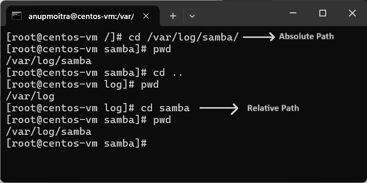

# **Module 2: File System Navigation**

## **Chapter 11: Absolute and Relative Paths**

### **Introduction**  
In this chapter, we will explore how to navigate the file system using both **absolute** and **relative paths**. Understanding these paths is crucial for efficiently accessing directories and managing files within a Linux environment.

**What We Will Learn:**
- The difference between absolute and relative paths.
- How to use `cd` to navigate to directories using both path types.
- Commands for verifying the current directory and moving up the directory tree.

---

### **1. Understanding Absolute and Relative Paths**

**Absolute Path**:
- An absolute path always starts with a slash `/`, indicating that the path begins at the root directory.
- Example: To navigate directly to the Samba folder within `/var/log/`, use:
  ```bash
  cd /var/log/samba
  ```

**Relative Path**:
- A relative path does not start with a slash and refers to a location relative to the current directory.
- Example: If you are currently in `/var`, to navigate to the `logs` directory, use:
  ```bash
  cd logs
  ```
  Since `logs` is a subdirectory of `/var`, you don’t need to specify the root `/` again.

**Key Differences**:
- Absolute paths specify a complete path starting from the root.
- Relative paths specify locations based on your current position in the file system.

### Screenshot Example
Below is an example of navigating to directories using both absolute and relative paths:

  
*Figure 1: Example of navigating directories using absolute and relative paths.*

---

### **2. Tab Completion**

**Tab Completion**:
- Press `Tab` to auto-complete directory and file names. This helps reduce typing and avoids errors.

---

## **Conclusion**

Understanding how to navigate the Linux file system with **absolute** and **relative paths** is essential for efficient directory management. This knowledge will help you move between directories quickly, use the command line effectively, and build a strong foundation for more advanced Linux operations.

---
