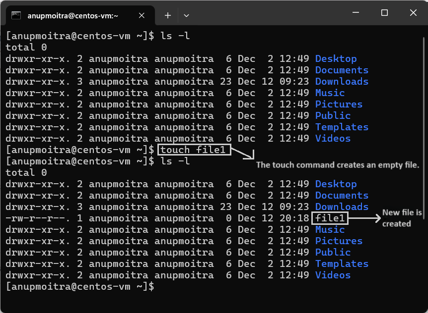
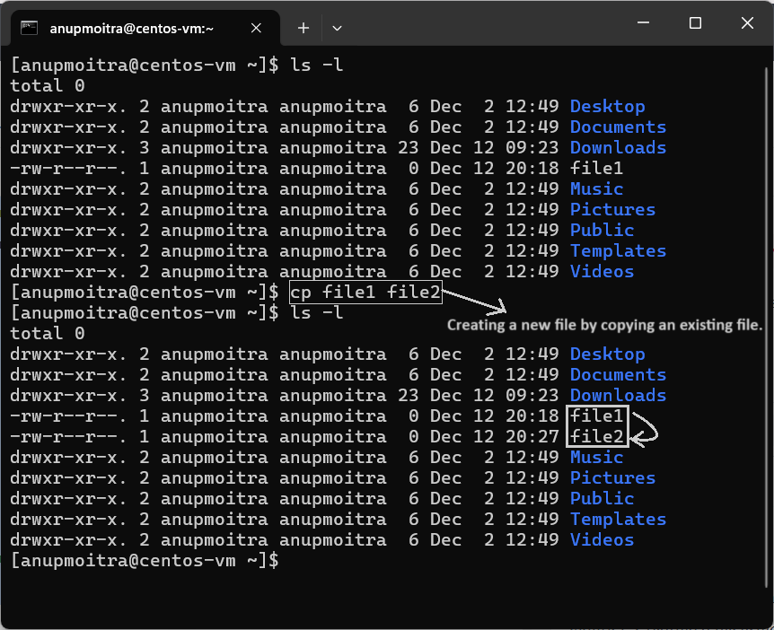
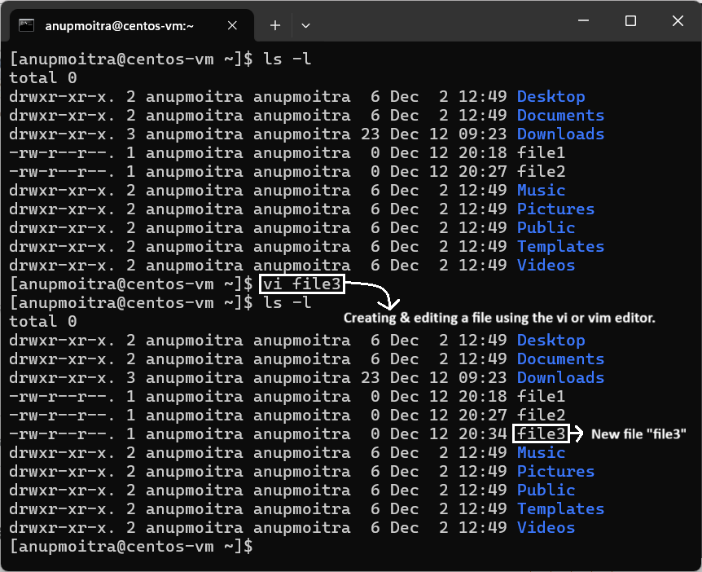
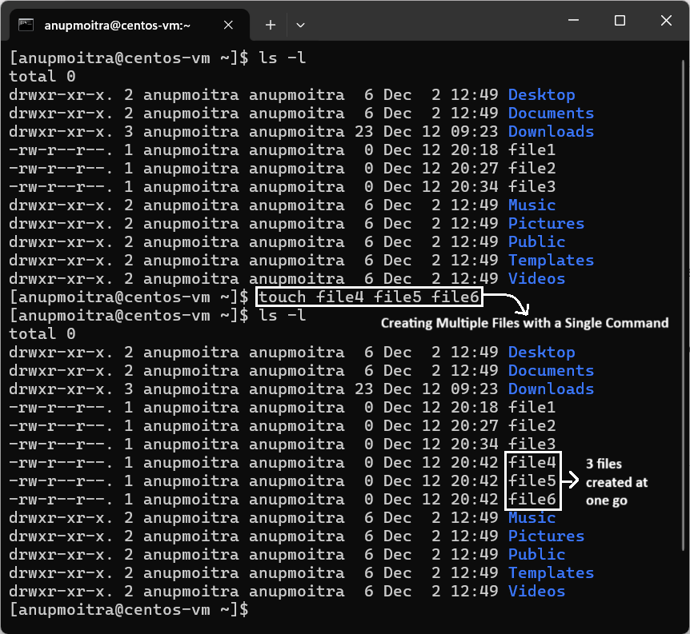
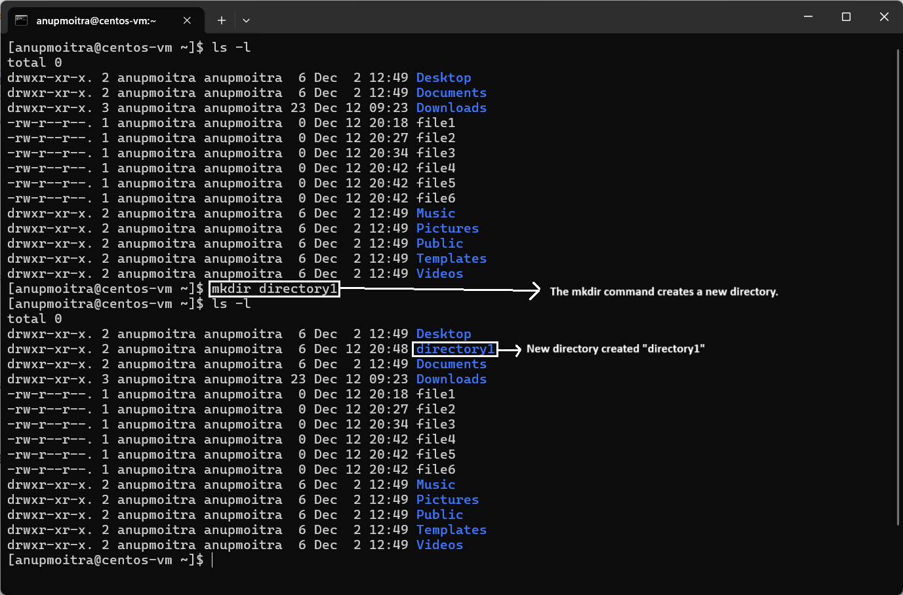
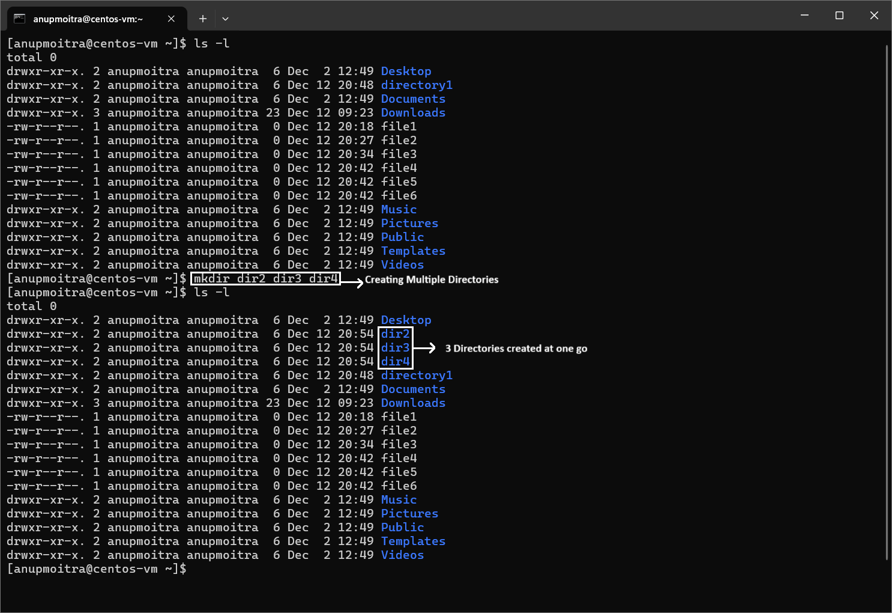

# Module 2: File System Navigation
## Chapter 12: Creating Files and Directories in Linux

### Introduction
In this chapter, we’ll explore various ways to create files and directories in Linux. These methods are essential for file management and organization in a Linux environment.

---

## Commands for Creating Files

### 1. **Using the `touch` Command**  
The `touch` command creates an empty file.  

**Example**:  
```bash
touch file1
```

To verify the file creation, use the `ls -l` command.  

**Screenshot Example**:  
  
*Figure 1: Creating a file using the `touch` command and verifying with `ls -l`.*

---

### 2. **Using the `cp` Command**  
You can create a new file by copying an existing file.  
Example:  
```bash
cp file1 file2
```
This command copies the contents of `file1` into a new file named `file2`.

**Screenshot:**  


---

### **3. Using the `vi` or `vim` Editor**  
You can create and edit a file using the `vi` or `vim` editor.  

**Example**:  
```bash
vi file3
```  

To save and exit:  
1. Make your edits in the file.  
2. Press `Esc` to enter command mode.  
3. Use one of the following commands:  
   - **`:wq`**: Save the file and quit.  
   - **`:wq!`**: Save the file and quit, overriding warnings (e.g., for read-only files).  

**Screenshot Example**:  
Below is a screenshot showing the process of saving and exiting the `vi` editor:  
  
*Figure 3: Saving and exiting the `vi` editor using `:wq`.*

---

### 4. **Creating Multiple Files with a Single Command**  
You can create multiple files in one go using `touch`.  
Example:  
```bash
touch file4 file5 file6
```
**Screenshot:**  


---

## Commands for Creating Directories

### 1. **Using the `mkdir` Command**  
The `mkdir` command creates a new directory.  
Example:  
```bash
mkdir directory1
```
**Screenshot:**  


---

### 2. **Creating Multiple Directories**  
You can create multiple directories at once with a single `mkdir` command.  
Example:  
```bash
mkdir dir2 dir3 dir4
```
**Screenshot:**  


---

### 3. **Verifying Directories**  
Use the `ls -l` command to confirm the directories were created.  
(Screenshot omitted as `ls -l` was covered in Chapter 3.)

---

## Permissions and Root Privileges

Files and directories can typically be created in locations you have permission to access, like your home directory. If you attempt to create a file or directory in a restricted area, such as `/etc`, you will receive a "Permission denied" error unless you are logged in as the `root` user or have elevated privileges.

Example of a failed attempt:  
```bash
touch /etc/restricted_file
```

**Screenshot:**  


To check your current user, use the `whoami` command:  
```bash
whoami
```
(Screenshot omitted as `whoami` was covered in Chapter 2.)

---

## Summary

In this chapter, we covered:
- Creating files using `touch`, `cp`, and `vi/vim`.
- Creating directories with `mkdir`.
- Handling permissions and understanding root privileges.

Master these commands to efficiently manage files and directories in Linux!

---
