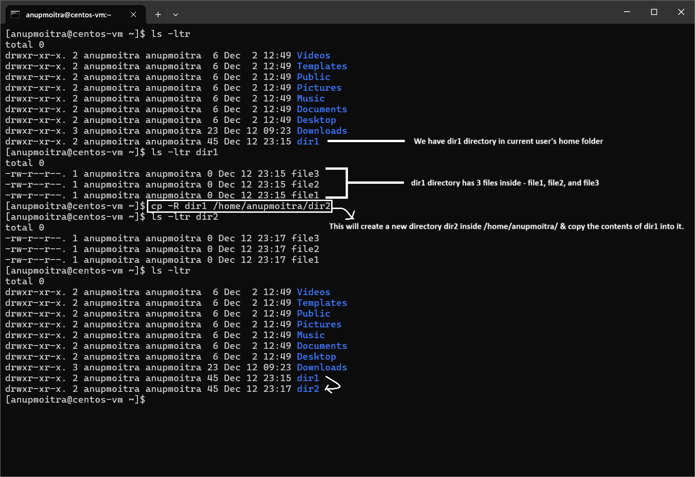
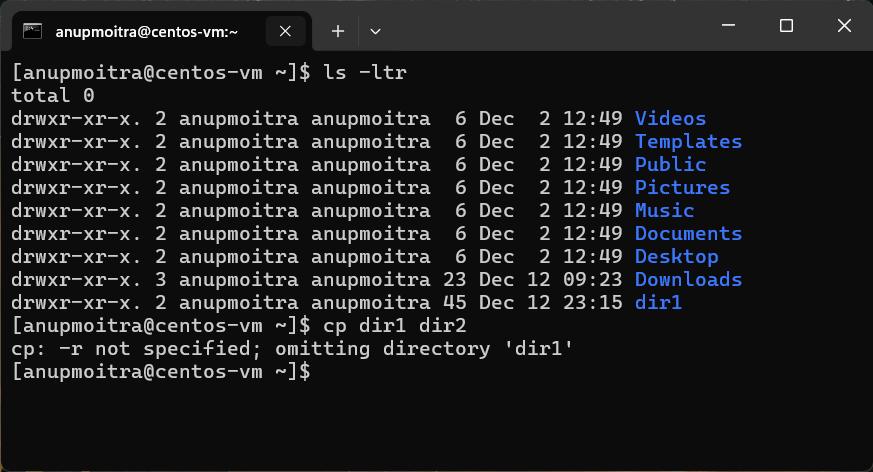

# **Module 2: System Access and File Management**  
## **Chapter 13: Copying Directories**

### **Introduction**  
In this chapter, we’ll explore how to copy directories in Linux. While we’ve previously covered file management techniques, copying directories is an essential skill, particularly when managing configuration files or backups. The `cp -R` command ensures that all contents, including subdirectories and files, are copied over correctly, preserving the directory structure.

---

## **The `cp` Command for Copying Directories**

The `cp` command is used to copy files, but when dealing with directories, we must add the `-R` (recursive) option. This tells the system to copy not only the directory but also all of its contents, including files and subdirectories.

### 1. **Using the `cp` Command with the `-R` Option**  
To copy a directory, you use the `cp` command with the `-R` option. The basic syntax is:

```
cp -R source_directory destination_directory
```

- **`-R`**: This option copies the directory and all its contents (subdirectories and files), ensuring that the entire directory structure is preserved. Without this option, only files would be copied, and directories would be omitted.
- **`source_directory`**: The directory you want to copy.
- **`destination_directory`**: The location where you want the directory to be copied to. If the destination directory does not exist, it will be created. Additionally, you can specify a new name for the copied directory by adding the desired name after the destination path. For example:

```bash
cp -R dir1 /home/anupmoitra/dir2
```

This will copy the `dir1` directory, along with all its contents, to the `/home/anupmoitra/dir2` directory. If `dir2` does not exist, it will be created.

**Screenshot Example**:  
  
*Figure 1: Copying the `dir1` directory to `/home/anupmoitra/dir2` using the `cp -R` command.*

---

### 2. **What Happens Without the `-R` Option?**  
If you try to copy a directory without using the `-R` option, you will encounter an error because `cp` will assume that you are trying to copy a file, not a directory.

For example, running this command:

```bash
cp dir1 dir2
```

will produce an error like:

```
cp: omitting directory 'dir1'
```

This is because `cp` cannot copy a directory unless you specify `-R` to handle the recursive copy. The `-R` option tells `cp` to copy all files and subdirectories within the source directory.

**Screenshot Example**:  
  
*Figure 2: Error message when trying to copy a directory without using the `-R` option.*

---

## **Verifying the Copied Directory**

After running the `cp -R` command, it’s important to verify that the directory and its contents were copied successfully. To do this, navigate to the destination directory and list its contents using the `ls -l` command:

```bash
cd /home/anupmoitra/dir2
ls -l
```

This will display the contents of the `dir1` directory within `/home/anupmoitra/dir2`. You should see the same files that were in the original `dir1` directory.

---

## **Important Notes**

- **Recursive Copy**: The `-R` option is essential when copying directories. It ensures that subdirectories and files within the directory are included. Without `-R`, only files are copied, and subdirectories will be omitted, resulting in an incomplete copy.
- **Permissions**: You need the necessary permissions to copy directories into certain locations. For system directories, you may need to use `sudo` to ensure you have the required privileges to perform the operation.

**Example with Elevated Privileges**:  
```bash
sudo cp -R dir1 /etc/backup
```

This command copies the `dir1` directory to `/etc/backup` with elevated privileges, which may be necessary when copying to system directories or restricted locations.

---

## **Summary**

In this chapter, we covered:  
- How to copy directories using the `cp` command with the `-R` option.  
- How to specify a different name for the copied directory.  
- Verifying that the directory and its contents were copied successfully.

Mastering the `cp` command with the `-R` option is crucial for managing directories and creating backups or duplicating files within a Linux system.

---
