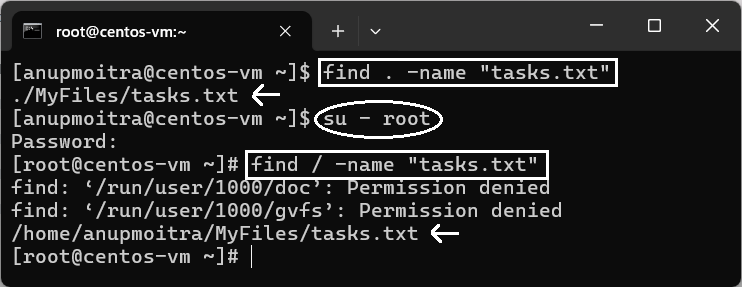

# **Module 2: System Access and File Management**  
## **Chapter 14: Finding Files and Directories (find, locate)**  

### **Preparation Before Starting**  
Before diving into this chapter, set up your practice environment by following these steps from your home directory:  

1. **Create practice files**:  
   Run the following commands to create sample `.txt` files:  

   ```bash
   touch report.txt notes.txt tasks.txt
   ```  

   This will create three text files: `report.txt`, `notes.txt`, and `tasks.txt`.  

2. **Create the target directory and move files**:  
   Now, create a directory named `MyFiles` and move the created files into it:  

   ```bash
   mkdir MyFiles
   mv report.txt notes.txt tasks.txt MyFiles
   ```  

   This ensures you have a directory (`MyFiles`) with the necessary files to practice the examples in this lesson.  

---

### **Introduction**  
In this chapter, we’ll explore how to locate files and directories in Linux using the powerful `find` and `locate` commands. These tools allow users to search for files and directories quickly based on criteria such as name, type, and modification date. Mastering these commands is essential for efficiently navigating and managing a Linux file system.  

---

## **The `find` Command**  

The `find` command searches for files and directories within a specified directory and its subdirectories based on a set of criteria.  

### **1. Basic Syntax of the find Command**

The basic syntax for the find command is:

bash
find [path] [expression]


- **path**: The directory to start the search (e.g., . for the current directory or /home for a specific directory).
- **expression**: Criteria for the search, such as -name.

#### Example 1: Search in the Current Directory
bash
find . -name "tasks.txt"

This command searches for a file named tasks.txt in the current directory (.) and all its subdirectories.

#### Example 2: Search from the Root Directory
bash
find / -name "tasks.txt"

This command searches for a file named tasks.txt starting from the root directory (/) and includes all subdirectories on the system. Be cautious when running this command on the entire filesystem, as it may return permission-denied errors for certain system directories, unless you're running it with root privileges.

#### **Note:**
- Both find . -name "tasks.txt" and find . -name tasks.txt will function the same way when searching for tasks.txt.
- The **quotes** around "tasks.txt" are typically used when a filename contains spaces or special characters, or to prevent the shell from expanding globbing characters (like *, ?, etc.).
- In this case, since tasks.txt has no spaces or special characters, the quotes are optional, and the command will work the same without them.

#### Example 2: Search from the Root Directory
```bash
find / -name "tasks.txt"
```
This command searches for a file named `tasks.txt` starting from the root directory (`/`) and includes all subdirectories on the system. Be cautious when running this command on the entire filesystem, as it may return permission-denied errors for certain system directories, unless you're running it with root privileges.  



---

## **The `locate` Command**  

The `locate` command is a faster alternative to `find` as it uses a prebuilt database of files on the system.  

### 1. **Using the `locate` Command**  
The basic syntax for the `locate` command is:  

```bash
locate [filename]
```  

Example:  

```bash
locate notes.txt
```  

This command quickly searches for all files and directories containing the name `notes.txt`.  

*Insert Screenshot of `locate notes.txt` command here.*

### 2. **Updating the Locate Database**  
The `locate` command relies on a database that needs periodic updates. Use the following command to update the database:  

```bash
sudo updatedb
```  

This ensures that the `locate` command returns up-to-date results.  

*Insert Screenshot of `sudo updatedb` command here.*

---

## **Key Differences Between `find` and `locate`**  

| Feature              | `find`                          | `locate`                    |  
|----------------------|----------------------------------|-----------------------------|  
| Speed                | Slower (real-time search)       | Faster (prebuilt database)  |  
| Flexibility          | Highly customizable criteria    | Limited to filename search  |  
| Up-to-date results   | Always (real-time search)       | Depends on database update frequency |  

---

## **Examples**  

### Example 1: Finding Files with `find`  
To locate a file named `tasks.txt` in the `/home` directory:  

```bash
find /home -name "tasks.txt"
```  

*Insert Screenshot of `find /home -name "tasks.txt"` command here.*

### Example 2: Using `locate` for Faster Search  
To quickly find a file containing the name `report`:  

```bash
locate report
```  

*Insert Screenshot of `locate report` command here.*

### Example 3: Finding Directories  
To locate directories named `MyFiles` in the current directory:  

```bash
find . -type d -name "MyFiles"
```  

---

## **Summary**  

In this chapter, we covered:  
- The `find` command for detailed and flexible file and directory searches.  
- The `locate` command for fast filename searches.  
- The differences between `find` and `locate`, along with their use cases.  

Mastering these tools will help you efficiently navigate and manage files on Linux systems, even in complex directory structures.  

---
