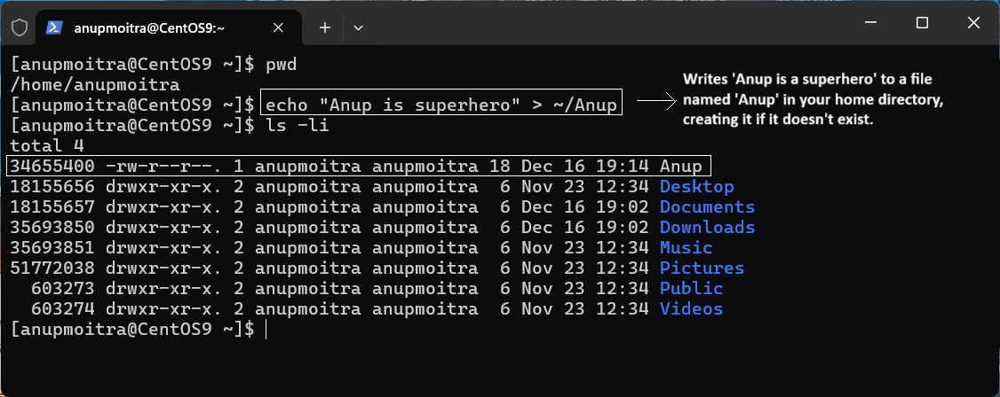
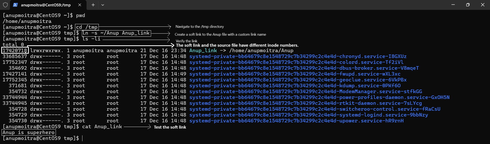

# **Module 2: System Access and File Management**

## **Chapter 16: Understanding Soft Links and Hard Links**

### **Introduction**  
In this chapter, we will cover **soft links** and **hard links**, two essential concepts in Linux file management. Before diving into these topics, let’s first understand **inodes**, a fundamental component of Linux filesystems.

---

## **Understanding Inodes**

An **inode** is a unique identifier (number) assigned to a file or directory on a hard disk.

- **For Humans:** We recognize files by their names (e.g., `Anup.txt`).
- **For Computers:** Names are meaningless; they recognize files using their associated inode numbers.

Each time a file is created, the filesystem generates an inode number pointing to the file's data on disk. When accessing a file, Linux refers to the inode to locate the data.

In addition to the file's data, the inode contains metadata such as:
- File size
- Permissions
- Ownership (user/group)
- Timestamps (e.g., creation, last access, last modification)

For example, when you run `ls -li` in a directory, the inode number is displayed at the beginning of each line, like this:

```
18168252 -rw-r--r-- 1 user user 1024 Dec 16 12:00 Anup.txt
```

In this output, `18168252` is the inode number of `Anup.txt`, and the inode points to the actual data on the disk.

  
*Figure 1: Example output of `ls -li`, showing the inode number and metadata for the file `Anup.txt`.*

---

### **Soft Links**

A **soft link** (or symbolic link) is like a shortcut to a file or directory.

#### **Key Features of Soft Links**:

1. **Dependency on the Source File**:
   - If the source file is deleted or renamed, the soft link becomes invalid.
   - The link points to the file path, not directly to the inode.
   
2. **Different Inodes**:
   - The soft link and the source file have different inode numbers.
   
3. **Usage Example**:
   - Soft links are ideal for creating shortcuts to frequently accessed files.

#### **Creating a Soft Link**

Use the following command:
```bash
ln -s <source_file> <link_name>
```

- `<source_file>`: This is the original file or directory you want to link to.
- `<link_name>`: This is the name of the symbolic link you want to create.  
  If you don't specify a `<link_name>`, the symbolic link will be created with the same name as the `<source_file>` in the current directory.

**Example**:

1. Create a file called `Anup` in your home directory:
   ```bash
   echo "Anup is a superhero" > ~/Anup
   ```

     
   *Figure 2: File 'Anup' created in the home directory.*

2. Navigate to the `/tmp` directory:
   ```bash
   cd /tmp
   ```

3. Create a soft link to the `Anup` file with a custom link name:
   ```bash
   ln -s ~/Anup Anup_link
   ```

4. Verify the link:
   ```bash
   ls -l
   ```

   Output will indicate the symbolic link with an `l` at the beginning (e.g., `lrwxrwxrwx`). The link will point to the source file (`Anup -> /home/user/Anup`).

5. Test the soft link:
   ```bash
   cat Anup_link
   ```

   Output: `Anup is a superhero`.

   If the source file is removed, the link will break and return an error when accessed.

     
   *Figure 3: Combined screenshot showing the entire process of creating, verifying, and testing the soft link `Anup_link`. This includes navigating to the `/tmp` directory, creating the soft link, verifying it with `ls -l`, testing it with `cat`, and demonstrating that if the source file is removed, the link becomes broken and returns an error when accessed.*

---

### **Hard Links**

A **hard link** is an additional reference to the same file.

#### **Key Features of Hard Links**:

1. **Independent of the Source File**:
   - Deleting or renaming the source file does not affect the hard link.
   - The data remains accessible because the link points directly to the inode.
   
2. **Same Inodes**:
   - Both the source file and the hard link share the same inode number.
   
3. **Usage Example**:
   - Hard links are useful for creating backups or accessing files from multiple locations.

#### **Creating a Hard Link**

Use the following command:
```bash
ln <source_file> <link_name>
```

**Example**:

1. Recreate the file `Anup` in your home directory:
   ```bash
   echo "Anup is a superhero" > ~/Anup
   ```

2. Navigate to the `/tmp` directory:
   ```bash
   cd /tmp
   ```

3. Create a hard link to the `Anup` file:
   ```bash
   ln ~/Anup Anup_hardlink
   ```

4. Verify the hard link:
   ```bash
   ls -li
   ```

   Notice that both the original file (`Anup`) and the hard link (`Anup_hardlink`) share the same inode number.

5. Modify the source file:
   ```bash
   echo "123" >> ~/Anup
   ```

6. Check the hard link:
   ```bash
   cat Anup_hardlink
   ```

   Output: `Anup is a superhero\n123`. This confirms that the hard link reflects changes made to the source file.

7. Remove the source file:
   ```bash
   rm ~/Anup
   ```

8. Verify the hard link:
   ```bash
   cat Anup_hardlink
   ```

   Output: `Anup is a superhero\n123`. This demonstrates that a hard link retains the data even if the source file is deleted.

---

### **Comparison: Soft Links vs. Hard Links**

| **Feature**             | **Soft Link**                                | **Hard Link**                                |
|-------------------------|----------------------------------------------|----------------------------------------------|
| **Inode Number**        | Different from the source file               | Same as the source file                      |
| **Dependency on Source**| Becomes invalid if the source is deleted     | Remains valid even if the source is deleted  |
| **Cross-File Systems**  | Can link files across different filesystems  | Cannot link files across different filesystems |
| **File Size Impact**    | Minimal (stores the file path)               | Shares the same size as the source file      |

---

## **Summary**

1. **Soft Links**: Work like shortcuts; they break if the source file is removed or renamed.
2. **Hard Links**: Serve as a direct reference to the file’s data, making them more resilient.

Understanding and using soft and hard links efficiently can enhance your file management and improve your workflow in Linux.

---
