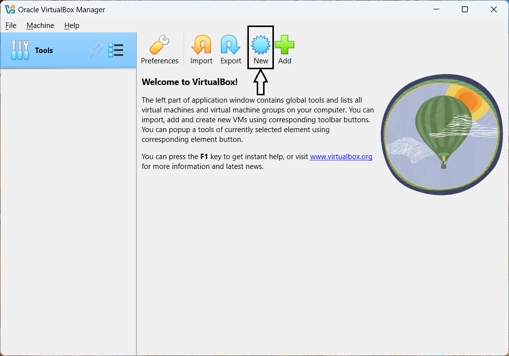
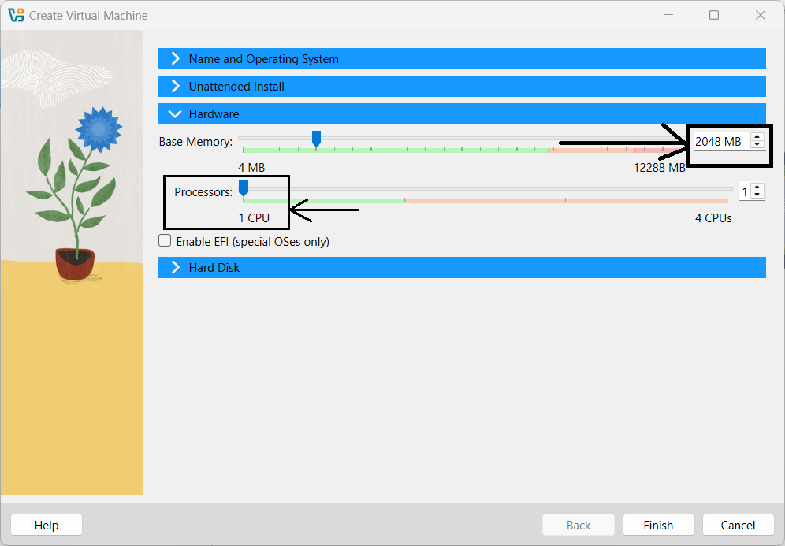

# Chapter 2: Creating and Configuring a Virtual Machine

## Introduction
In this chapter, I'll walk through the process of creating and configuring a virtual machine using VirtualBox. This will set the stage for the next chapter, where I'll download and install the current CentOS Stream version (CentOS Stream 9), a popular Linux OS, and set it up in the virtual machine.

---

## Step-by-Step Instructions

### 1. Launch VirtualBox
- Open **VirtualBox** from your system menu or desktop shortcut.

### 2. Create a New Virtual Machine
- Click on **"New"** to start the virtual machine setup wizard.
- Enter a name for the VM as **"CentOS Stream 9"**. Note that this is the VM's name in VirtualBox and not the hostname. The hostname will be set during the installation of the operating system.
- Choose the path/folder where the VM files will be stored (e.g., `C:\Users\<YourUsername>\VirtualBox VMs`). Ensure the location has enough storage space for the virtual machine and its disk images.
- When prompted to select the **ISO image** for the operating system, leave this option blank for now. I'll download the ISO image in the next chapter and configure it during the installation process.
- Choose **Linux** as the type, and set the version to **Red Hat (64-bit)**, as CentOS is based on Red Hat Enterprise Linux. Ensure that the version matches the distribution I plan to install (e.g., CentOS Stream 9 64-bit).
- Skip the **Unattended Installation** option, as I'll configure the installation settings manually to customize the setup according to my requirements.
- Proceed to the **Hardware Configuration** section and select the amount of **RAM** to allocate to the virtual machine. For CentOS Stream 9, a recommended minimum is 2 GB (2048 MB), but I can adjust this based on my system’s available resources and expected workload.
- In the **Processor** section, I leave the default setting at 1 CPU core for now. I can increase the number of cores later if needed, depending on performance requirements and my system’s capabilities.
- For the **Hard Disk**, I create a new virtual hard disk or use an existing one if needed. I choose **VDI (VirtualBox Disk Image)** as the disk type. I decide whether the disk should be **dynamically allocated** or **fixed size**, based on my preference. I set the hard disk size to 20 GB or more to ensure enough space for the operating system and applications.

---

### Configure Network Settings

- Once the VM is created, I go to "Settings" by selecting the VM and clicking the "Settings" button.
- Under **Network**, I ensure that the network adapter is enabled. By default, the adapter is set to **NAT**, but I change it to **Bridged Adapter**. This makes the VM part of the same network as the host machine, allowing it to communicate with other devices and access the internet as if it were a physical machine. I click **OK** to save the changes.

---

## Screenshots

### VirtualBox Main Window
  
*Locate the "New" button to start creating a new VM.*

### VM Creation Wizard - Name, Path, OS Type, and Version
  
*Input the VM name and path, and select the OS type and version. Choose **Linux** as the type and set the version to **Red Hat (64-bit)**, ensuring it matches the distribution to be installed (e.g., CentOS Stream 9 64-bit).*

### VM Creation Wizard - Hardware Configuration
  
*Allocate RAM to the VM, with a minimum of 2 GB (2048 MB) recommended for CentOS Stream 9, adjustable based on resources and workload. Keep the default of 1 CPU core, which can be increased later as needed for performance.*

---

## Note
The virtual machine is now set up and ready. In the next chapter, I'll download the ISO image of the Linux operating system, attach it to the VM, and walk through the installation process in detail.

Feel free to continue to the next chapter, where I'll cover downloading and setting up CentOS Stream 9 on the configured VM!
